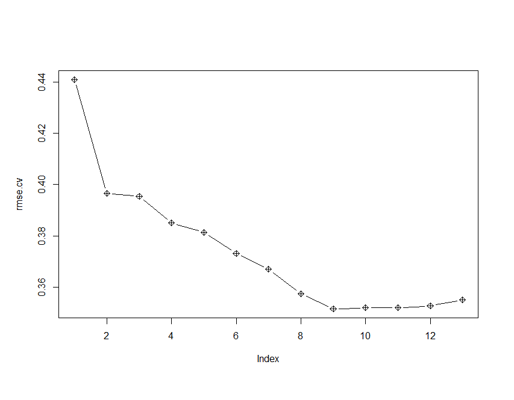
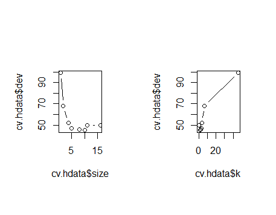

```{r setup, include=FALSE}
knitr::opts_chunk$set(echo = TRUE)
options(rsconnect.max.bundle.size=3145728000)
```
#__Heart Disease Dataset__


#__Introduction__

__Problem Statement__: Using some subset of the 13 explanatory variables provided from the [dataset](http://archive.ics.uci.edu/ml/datasets/heart+Disease), we want to predict the diagnosis of heart disease.  

__Dataset Summary__:

* Age
    + Age of Patient

* Sex
    + 1-male,0-female

* trestbps
    + Resting BP (in mmHg)

* chol
    + Serum Cholosterol in mg
    
* fbs
    + is fasting blood sugar>120? 1-true, 0-false

* restecg
    + resting caridographic result: 0-normal, 1-abnormal

* thalach
    + max heart rate achieved

* exang
    + exercise induced angina: 0-no, 1-yes

* oldpeak
    + ST depression induced by exercise relative to rest

* slope
    + 1-up, 2-flat, 3-down

* ca
    + number of major blood vessels (0-3)

* thal
    + 3 (normal), 6 (fixed defect), 7 (reversable defect)

* pnum (Response Variable)
    + Diagnosis of heart disease [int from 0 (healthy heart) to 5 (completely diseased heart) ]

* phd (Transformed Response Variable)
    + Diagnosis of heart disease (0-no heart disease, 1-heart disease)

```{r, include=FALSE}
#Load the required library
library(cvTools)
library(MASS)
library(car)
library(leaps)
library(ggplot2)

load('originaldata.RData')

# Read data in comma-delimited file
#setwd(work_dir) 
#rdata <- read.csv(srcFile, header=T)
# Remove rows having missing values
#rdata<-na.omit(rdata)
#nrow(rdata)
# Creating a new responce variable for presence of heart disease (phd) 
# phd = 0 for absence and phd = 1 for presence 
#phd<-ifelse(rdata$pnum>=1,1,0)
#rdata<-data.frame(rdata,phd)
#Save the data into a new dataframe "hdata'
hdata<-rdata
# Define categorical data
hdata$pnum<-factor(hdata$pnum)
hdata$sex<-factor(hdata$sex)
hdata$cp<-factor(hdata$cp)
hdata$fbs<-factor(hdata$fbs)
hdata$restecg<-factor(hdata$restecg)
hdata$exang<-factor(hdata$exang)
hdata$slope<-factor(hdata$slope)
hdata$ca<-factor(hdata$ca)
hdata$thal<-factor(hdata$thal)
hdata$phd<-factor(hdata$phd)
```

#__Original Dataset__
```{r}
str(rdata)
dim(rdata)
head(hdata)
```

#__New Dataset__
```{r}
str(hdata)
dim(hdata)
head(hdata)
```


#__Bad Models__

From this project, the question at hand is a categorical question: does the person have heart disease (either 0 or 1). However, regression modelling assumes continuous data. Using a continuous measurement makes for a bad model with very limited interpretability. Hence the models that did bad were:

###Multiple Linear Regression: 
  
  Important variables: sex1,cp4,trestbps,slope2,ca1,ca2,ca3,thal7
  
  Adjusted R^2: 0.5395
  
  Residual Standard Error (RSE)=0.3389

###Best Subset Selection, Forward Stepwise Selection, Backwards Stepwise Selection:

  Variables with lowest cp selected: 11/13 selected.
  
  Selected variables: sex1, cp4, trestbps, thalach, oldpeak,slope2, ca1,ca2,ca3,thal7

###Ridge Regression

  MSE=0.136
  
  Variables Shrunk to zero: age,chol,trestbps,thalach

###Lasso
  
  RMSE= 0.0247
  
  Variables Shrunk to zero: trestbps,oldpeak, thalach

###PCA

  Proportion of variance explained by PC1: 0.363
  
  Proportion of variance explained by PC2: 0.194

###K means Clustering

  classification efficiency=0.7

###Hierarchical Clustering

  classification efficiency=0.535


###Linear SVM

  Classification Efficiency=0.835

###Nonlinear SVM

  Classification Efficiency=0.741


#__Good Models__


###Logistic Regression

  Significant Variables: age, sex1, cp4, trestbps, slope2,ca1,ca2,ca3,thal7
  
  Classification Efficiency= 0.87

###Linear Discriminant Analysis
  
  Classification Efficiency= 0.857  

###Quadratic Discriminant Analysis
  
  Classification Efficiency=0.812

###K Nearest Neighbors

  @ k=17, maximum classifcation efficiency=0.8
  
###Classification Tree

  Classification Efficiency=0.91

###Boosting, Bagging, Random Forest, Pruning

  After pruning, Classification efficieny decreased from 0.91 to 0.8
  
  Random Forest w/ Bagging created a model w/ out of bag error of 0.1751
  
  After boosting, the classifcation Efficiency=0.8711
  

#__Scatterplot Matrices__
```{r}
pairs(~pnum + age+ sex+cp+trestbps+chol+fbs+
        restecg+thalach+exang+oldpeak+slope+
        ca+thal, data=hdata, 
      main="Simple Scatterplot Matrix")

# Scatterplot Matrices from the car Package
scatterplot.matrix(~ age+ trestbps+chol+
              thalach+oldpeak+ca|pnum, data=hdata, 
              main="Scatter Plot Matrix on the pnum Factor")

scatterplot.matrix(~age+ trestbps+chol+
                     thalach+oldpeak+ca|phd, data=hdata, 
                   main="Scatter Plot Matrix on the phd Factor")
#----------------------------------------------------------------------
# Individual Scatter Plots
ggplot(hdata, aes(age, y = pnum, color = sex)) + 
  geom_point(size = 2)

ggplot(hdata, aes(trestbps, y = pnum, color = sex)) + 
  geom_point(size = 2)
ggplot(hdata, aes(chol, y = pnum, color = sex)) + 
  geom_point(size = 2)


ggplot(hdata, aes(thalach, y = pnum, color = sex)) + 
  geom_point(size = 2)

ggplot(hdata, aes(oldpeak, y = pnum, color = sex)) + 
  geom_point(size = 2)


#---------------------------------------------------------------
#Box Plots of contineous variables wr.to 'pnum'
ggplot(hdata, aes(x = pnum, y = age, fill = sex)) +
  geom_boxplot(outlier.size = 1.5)
ggplot(hdata, aes(x = pnum, y = trestbps, fill = sex)) +
  geom_boxplot(outlier.size = 1.5)
ggplot(hdata, aes(x = pnum, y = chol, fill = sex)) +
  geom_boxplot(outlier.size = 1.5)
ggplot(hdata, aes(x = pnum, y = thalach, fill = sex)) +
  geom_boxplot(outlier.size = 1.5)
ggplot(hdata, aes(x = pnum, y = oldpeak, fill = sex)) +
  geom_boxplot(outlier.size = 1.5)
#------------------------------------------------------------
#Box Plots of contineous variables wr.to 'phd'
ggplot(hdata, aes(x = phd, y = age, fill = sex)) +
  geom_boxplot(outlier.size = 1.5)
ggplot(hdata, aes(x = phd, y = trestbps, fill = sex)) +
  geom_boxplot(outlier.size = 1.5)
ggplot(hdata, aes(x = phd, y = chol, fill = sex)) +
  geom_boxplot(outlier.size = 1.5)
ggplot(hdata, aes(x = phd, y = thalach, fill = sex)) +
  geom_boxplot(outlier.size = 1.5)
ggplot(hdata, aes(x = phd, y = oldpeak, fill = sex)) +
  geom_boxplot(outlier.size = 1.5)
```


#__Multiple Linear Regression__

```{r}
#------------------------------------------------------------
# Multipple Linear Regression to Predict 'phd' for absence or presence of heart disease
# Multiple regression model is not justified for 'pnum' which has five levels.
# Thus, MLR is developed for 'phd' having two levels.
#Remove 'pnum' variable as the responce variable 'phd' has been created from it
hdata$pnum<-NULL
# make 'phd' response variable as a non-categorical variable for running regression
hdata$phd<-NULL
phd<-rdata$phd
hdata<-data.frame(hdata,phd)
mlr.fit <- lm(phd~age+sex+cp+trestbps+chol+fbs+
            restecg+thalach+exang+oldpeak+slope+ca+
            +thal, data=hdata)
summary(mlr.fit) # show results
summary(fitted(mlr.fit)) # predicted values
# Looking at the summary of predicted values,it contains values less than
# zero and higher than 1 wheraes as the predictor 'phd' values ranges from 0 to 1 only.
# Thus, for this problem use of classification model is more appropriate.
summary(residuals(mlr.fit)) # residuals
anova(mlr.fit) # anova table 
vcov(mlr.fit) # covariance matrix for model parameters 
#influence(mlr.fit) # regression diagnostics
# diagnostic plots 
plot(mlr.fit)
#-------------------------------------------------------
# It can be noticed several predictors were having poor t-values, indcating
# this model can be improved by selecting more appropriate variables.
```
The summary of linear regression explains that there are few significant predictive variables that are useful. However, R squared value explains only 50% of variations in this model.  Also the summary of predicted values indicates that there are values less than zero and greater than one, which reveals that it is not a good model since phd variables only contain values from zero to one. 

For residual analysis, we plotted fitted values versus residuals of the model. As we expected, the residual plot explains that this is a poor method of predicting responsive variables. A residual plot of a good model indicates a random and dispersed patterns of dots; however, our graph shows some patterns, which explain that some of the variables have poor t values. Thus, other models such as classification is more appropriate for this data. 


#__Best Subset Selection__
```{r}
#Best Subset Regression
#Load package `leaps` to evaluate all best-subset models.
library(leaps)
regfit.full=regsubsets( phd~.,data=hdata)
summary(regfit.full)
#It gives by default best-subsets up to size 8; 
#lets increase that to 13 predictsors.
regfit.full=regsubsets(phd~.,data=hdata, nvmax=13)
reg.summary=summary(regfit.full)
names(reg.summary)
plot(reg.summary$cp,xlab="Number of Variables",ylab="Cp")
which.min(reg.summary$cp)
points(11,reg.summary$cp[10],pch=20,col="red")#Point out the Minima
#Alternatively there is a plot method for the `regsubsets`  object
plot(regfit.full,scale="Cp")
coef(regfit.full,11)
```

Best Subset Selection, Forward stepwise selection, Backward stepwise selection
Through the best subset selection, the number of variables with lowest cp value was 11, which were sex1, cp4, trestbps, thalach, exang1, oldpeak, slope2, ca1, ca2, ca3, and thal7. 


#__Forward Stepwise Selection__
```{r}
#---------------------------------------------------------------
#Forward Stepwise Selection
#`regsubsets`function but specify the `method="forward" option
regfit.fwd=regsubsets(phd~.,data=hdata,nvmax=13,method="forward")
summary(regfit.fwd)
plot(regfit.fwd,scale="Cp")


#Training and validation set for choosig a good subset model.
set.seed(1234)

#about 71% data was selected as training data
#Generate a random sequence of 212 observations from data 
train=sample(seq(297),212,replace=FALSE)
regfit.fwd=regsubsets(phd~.,data=hdata[train,],nvmax=13,method="forward")
```


#__Backward Stepwise Selection__
```{r}
#---------------------------------------------------------------
#Backward Stepwise Selection
#`regsubsets`function but specify the `method="forward" option
regfit.bwd=regsubsets(phd~.,data=hdata,nvmax=13,method="backward")
summary(regfit.bwd)
plot(regfit.bwd,scale="Cp")


#Training and validation set for choosig a good subset model.
set.seed(1234)

#about 71% data was selected as training data
#Generate a random sequence of 212 observations from data 
train=sample(seq(297),212,replace=FALSE)
regfit.bwd=regsubsets(phd~.,data=hdata[train,],nvmax=13,method="backward")
```

 The same process were performed in forward stepwise selection was used for backward stepwise selection. They both had the same result as best subset selection. 

#__Model Selection by Validation__


```{r}
#Make predictions on the observations not used for training. 
#We know there are 13 models, so we set up some vectors to 
#record the errors. 
val.errors=rep(NA,13)
x.test=model.matrix(phd~.,data=hdata[-train,])# notice the -index!
for(i in 1:13){
  coefi=coef(regfit.fwd,id=i)
  pred=x.test[,names(coefi)]%*%coefi
  val.errors[i]=mean((hdata$phd[-train]-pred)^2)
}

```

```{r}
str(hdata$phd[-train])
sqrt(val.errors)
which.min (val.errors )
#Selected Model Coefficients based on Validation
coef(regfit.fwd ,9)
summary(sqrt(val.errors))
plot(sqrt(val.errors),ylab="Root MSE",ylim=c(0.3,0.5),pch=19,type="b")
points(sqrt(regfit.fwd$rss[-1]/212),col="blue",pch=19,type="b")
legend("topright",legend=c("Training","Validation"),col=c("blue","black"),pch=19)
#As we expect, the training error goes down monotonically as the model 
#gets bigger, but not so for the validation error.
#predict method for `regsubsets`. 
predict.regsubsets=function(object,newdata,id,...){
  form=as.formula(object$call[[2]])
  mat=model.matrix(form,newdata)
  coefi=coef(object,id=id)
  mat[,names(coefi)]%*%coefi
}
```


#__Mode Selection by Cross Validation__
```{r}
#Model Selection by Cross-Validation
#We will do 10-fold cross-validation. Its really easy!
set.seed(3011)
folds=sample(rep(1:9,length=nrow(hdata)))
folds
str(folds)
dim(folds)
head(folds)
table(folds)
cv.errors=matrix(NA,9,13)
```

```{r, include=FALSE}
for (k in 1:9)
{k}
```

>for(k in 1:9){

>  best.fit=regsubsets(phd~.,data=hdata[folds!=k,],nvmax=13,method="forward")
  
>  for(i in 1:13){
  
>    pred=predict(best.fit,hdata[folds==k,],id=i)
    
>    cv.errors[k,i]=mean( (hdata$phd[folds==k]-pred)^2)
    
>  }
  
>}

>str(pred)

 num [1:33, 1] 0.3242 -0.2103 0.6919 -0.0658 0.9028 ...
 
 - attr(*, "dimnames")=List of 2
 
  ..$ : chr [1:33] "18" "27" "34" "47" ...
  
  ..$ : NULL

>hdata$phd[folds == k]

 [1] 0 0 0 0 1 0 1 1 1 0 1 0 1 0 1 0 0 0 0 1 0 1 0 0 1 0 1 1 0 0 1 1 1

>rmse.cv=sqrt(apply(cv.errors,2,mean))

>which.min (rmse.cv )

[1] 9

(Selected Model Coefficients based on Cross-Validation:)

>coef(best.fit ,10)


 (Intercept)         sex1          cp4     trestbps       exang1      oldpeak       slope2          ca1 
 
-0.478462276  0.149991221  0.263423074  0.002737387  0.090927462  0.062566427  0.160938411  0.238090658 


         ca2          ca3        thal7 
         
 0.288187563  0.233378562  0.215875498 


>plot(rmse.cv,pch=9,type="b")



#__Ridge Regression__
```{r}
#----------------------------------------------------------

#Ridge Regression and the Lasso
# package `glmnet`, which does not use the 
#model formula language, so we will set up an `x` and `y`.
library(glmnet)
x=model.matrix(phd~.-1,data=hdata) 
y=hdata$phd
set.seed (101)
train=sample (1: nrow(x), nrow(x)/2)
str(train)
# fit a ridge-regression model. This is achieved by 
#calling `glmnet` with `alpha=0`. 
#There is also a `cv.glmnet` function which will do 
#the cross-validation for us.
fit.ridge=glmnet(x,y,alpha=0)
plot(fit.ridge,xvar="lambda",label=TRUE)
# Use Cross Validation to determine the tuning parameter ?? (bestlam)
cv.ridge=cv.glmnet(x[train ,],y[train],alpha =0)
plot(cv.ridge)
bestlam =cv.ridge$lambda.min
bestlam
#test MSE associated with the best `lambda` value
ridge.mod =glmnet (x[train ,],y[train],alpha =0)
ridge.pred=predict (ridge.mod ,s=bestlam ,newx=x[-train ,])
mean(( ridge.pred -y[-train])^2)
# Refit our ridge regression model on the full data set,
# using `lambda` = bestlam chosen by cross-validation and examine 
# the coefficient estimates.
fit.ridge=glmnet(x,y,alpha=0)
predict (fit.ridge ,type="coefficients",s=bestlam )[1:14 ,]
```

#__Lasso Method__

```{r}
#Fit a lasso model; for this we use the default `alpha=1`
fit.lasso=glmnet(x,y)
plot(fit.lasso,xvar="lambda",label=TRUE)
cv.lasso=cv.glmnet(x,y)
plot(cv.lasso)
coef(cv.lasso)

#Suppose we want to use our earlier train/validation division to 
#select the `lambda` for the lasso.
lasso.tr=glmnet(x[train,],y[train])
lasso.tr
pred=predict(lasso.tr,x[-train,])
dim(pred)
rmse= sqrt(apply((y[-train]-pred)^2,2,mean))
plot(lasso.tr$lambda,rmse,type="b",xlab="lambda")
plot(log(lasso.tr$lambda),rmse,type="b",xlab="Log(lambda)")
lam.best=lasso.tr$lambda[order(rmse)[1]]
lam.best
#Coefficients of lasso Model
coef(lasso.tr,s=lam.best)
```


#__Logistic Regression__
```{r}
# Classification models [Logistic, LDA,QDA, KNN]
hdata$phd<-factor(hdata$phd)
# Logistic regression
glm.fit=glm(phd~age+ sex+cp+trestbps+chol+fbs+
              restecg+thalach+exang+oldpeak+slope+
              ca+thal, data=hdata,family=binomial)
summary(glm.fit)
glm.probs=predict(glm.fit,type="response") 
glm.probs[1:5]
summary(glm.probs)
# Use a threshold probability value of 0.5 to convert logistic regression
# predictions into the categorical output
threshold <-0.5
glm.pred=ifelse(glm.probs>threshold,1,0)
#attach(hdata)
table(glm.pred,phd)
mean(glm.pred==phd)
# So far we used the complete dataset. Now, make training and test data sets
set.seed(1099)
train=sample(seq(297),212,replace=FALSE)#about 70% data was selected as training data
length(train)

glm.fit=glm(phd~age+ sex+cp+trestbps+chol+fbs+
              restecg+thalach+exang+oldpeak+slope+
              ca+thal, data=hdata,family=binomial)
glm.probs=predict(glm.fit,newdata=hdata[-train,],type="response") 
glm.pred=ifelse(glm.probs >threshold,1,0)
test_data=hdata$phd[-train]
table(glm.pred,test_data)
mean(glm.pred==test_data)
# Using ROC Curve for determining 'threshold'
library(ROCR)
pred_roc <- prediction(glm.probs, test_data)
perf <- performance(pred_roc,"tpr","fpr")
plot(perf)
plot(perf,colorize=TRUE)
perf_spec <- performance(pred_roc, "sens", "spec")
plot(perf_spec)
# Listing threshold cutoff values alongwith fpr and tpr
cutoffs <- data.frame(cut=perf@alpha.values[[1]], fpr=perf@x.values[[1]],                       tpr=perf@y.values[[1]])
cutoffs <- cutoffs[order(cutoffs$tpr, decreasing=TRUE),]
#head(subset(cutoffs, fpr < 0.2))
# Calculating best threshold
best_threshold <- function(predict, response) {
  perf <- ROCR::performance(ROCR::prediction(predict, response), "sens", "spec")
  df <- data.frame(cut = perf@alpha.values[[1]], sens = perf@x.values[[1]], spec = perf@y.values[[1]])
  df[which.max(df$sens + df$spec), "cut"]}
predict<-pred_roc@predictions[[1]]
response<-pred_roc@labels[[1]]
best_cutoff<-best_threshold(predict, response)
# False Positive Rate (fpr) and True Positive Rate(tpr) corresponding to best Cutoff
subset(cutoffs, cut == best_cutoff)
```

Logistic regression performed to predict over phd variable had prediction efficiency of about 86% over total dataset.  From the training data set using about 70% of the total dataset, prediction efficiency was about 81%.  Then ROC curve over the logistic regression indicates true positive rate of about 85%.

#__Linear Discriminant Analysis__
```{r}
require(MASS)
## Linear Discriminant Analysis
set.seed(1678)
train=sample(seq(297),212,replace=FALSE)
test_data=hdata$phd[-train]
length(test_data)
# Fit LDA Model
lda.fit=lda(phd~age+ sex+cp+trestbps+chol+fbs+
              restecg+thalach+exang+oldpeak+slope+
              ca+thal, data=hdata, subset=train)
lda.fit
plot(lda.fit)
# Make Predictions Using Test Data
lda.pred=predict(lda.fit,newdata=hdata[-train,])
str(lda.pred)
data.frame(lda.pred)[1:5,]
table(lda.pred$class,test_data)
mean(lda.pred$class==test_data)
# Using ROC Curve for determining 'threshold'
library(ROCR)
pred_roc <- prediction(lda.pred$posterior [ ,2], test_data)
perf <- performance(pred_roc,"tpr","fpr")
plot(perf)
plot(perf,colorize=TRUE)
perf_spec <- performance(pred_roc, "sens", "spec")
plot(perf_spec)
# Listing threshold cutoff values alongwith fpr and tpr
cutoffs <- data.frame(cut=perf@alpha.values[[1]], fpr=perf@x.values[[1]],                       tpr=perf@y.values[[1]])
cutoffs <- cutoffs[order(cutoffs$tpr, decreasing=TRUE),]
#head(subset(cutoffs, fpr < 0.2))
# Calculating best threshold
best_threshold <- function(predict, response) {
  perf <- ROCR::performance(ROCR::prediction(predict, response), "sens", "spec")
  df <- data.frame(cut = perf@alpha.values[[1]], sens = perf@x.values[[1]], spec = perf@y.values[[1]])
  df[which.max(df$sens + df$spec), "cut"]}
predict<-pred_roc@predictions[[1]]
response<-pred_roc@labels[[1]]
best_cutoff<-best_threshold(predict, response)
# False Positive Rate (fpr) and True Positive Rate(tpr) corresponding to best Cutoff
subset(cutoffs, cut == best_cutoff)
```


#__Quadratic Discriminant Analysis__

```{r}
## Quadratic Discriminant Analysis
qda.fit=qda(phd~age+ sex+cp+trestbps+chol+fbs+
              restecg+thalach+exang+oldpeak+slope+
              ca+thal, data=hdata, subset=train)
qda.fit
qda.pred=predict(qda.fit,newdata=hdata[-train,])
data.frame(qda.pred)[1:5,]
table(qda.pred$class,test_data)
mean(qda.pred$class==test_data)
# Using ROC Curve for determining 'threshold'
library(ROCR)
pred_roc <- prediction(qda.pred$posterior [ ,2], test_data)
perf <- performance(pred_roc,"tpr","fpr")
plot(perf)
plot(perf,colorize=TRUE)
perf_spec <- performance(pred_roc, "sens", "spec")
plot(perf_spec)
# Listing threshold cutoff values alongwith fpr and tpr
cutoffs <- data.frame(cut=perf@alpha.values[[1]], fpr=perf@x.values[[1]],                       tpr=perf@y.values[[1]])
cutoffs <- cutoffs[order(cutoffs$tpr, decreasing=TRUE),]
#head(subset(cutoffs, fpr < 0.2))
# Calculating best threshold
best_threshold <- function(predict, response) {
  perf <- ROCR::performance(ROCR::prediction(predict, response), "sens", "spec")
  df <- data.frame(cut = perf@alpha.values[[1]], sens = perf@x.values[[1]], spec = perf@y.values[[1]])
  df[which.max(df$sens + df$spec), "cut"]}
predict<-pred_roc@predictions[[1]]
response<-pred_roc@labels[[1]]
best_cutoff<-best_threshold(predict, response)
# False Positive Rate (fpr) and True Positive Rate(tpr) corresponding to best Cutoff
subset(cutoffs, cut == best_cutoff)
#-----------------------------------------------------
```


#__K Nearest Neighbors__

```{r}
## K-Nearest Neighbors
library(class)
# Data Prepration: select data that needs to be normalized 
Xval<-rdata[c(1,3:5,7,8,10:13)]
#Normalize input values as they differ in scale
Xval<-scale(Xval)
Xval<-cbind(Xval,hdata[c(2,6,9)])
set.seed(2998)
train=sample(seq(297),212,replace=FALSE)
corr_classification<-list()
mis_classification<-list()
K<-seq(1:20)
for(i in 1:20){
  k=K[i]
knn.pred=knn(Xval[train,],Xval[-train,],hdata$phd[train],k)
table(knn.pred,hdata$phd[-train])
corr_classification[k]<-mean(knn.pred==hdata$phd[-train])
mis_classification[k]<-mean(knn.pred!=hdata$phd[-train])
}
knnResult<-cbind(K,corr_classification,mis_classification)
knnResult

plot(K, corr_classification, main="KNN Classification Scatterplot", 
     xlab="k-value ", ylab="Correct Classification ", pch=19)
lines(lowess(K,corr_classification), col="blue") # lowess line (x,y)
#---------------------------------------------------------------
#Save R Data Files for further Analysis
phd<-hdata$phd
kdata<-cbind(Xval,phd)
```

Knn algorithm is very useful to predict some categorical data.
The logic is very easy to understand and also algorithm is also easy.
However, there is a thing we have to be careful. That is the number of k nearest points.
The result would be totally different depends on the number of k nearest points. 

That's why I thought this insight is meaningful. This insight is about the correlation between the number of k nearest points and the probability of correct classification.

Since we got the best probability when k = 17, so this insight was pretty successful and meaningful when we predict some categorical data.


#__Fitting a Classification Tree__
```{r}
#Decision Tree Regression & Classification
library (tree)
#Fit a classification tree model to predict phd' 
#using all variables except 'lprice'
tree.fit =tree(phd~. ,hdata )
summary (tree.fit)
plot(tree.fit )
text(tree.fit ,pretty =0)
tree.fit
# Selecting Training & Testing Data Sets for Decision Tree Randomly
# Training data set = 212
# Test data set = 297 - 212 = 85
set.seed (1923)
train=sample (1: nrow(hdata ), 212)
hdata.test=hdata [-train ,]
phd.test=hdata$phd[-train ]
#Fitting the tree model using training data
tree.fit =tree(phd~. ,hdata ,subset =train )
#Prediction using the fitted model and test data
tree.pred=predict (tree.fit ,hdata.test ,type ="class")
table(tree.pred ,phd.test)
#Improving Model through Purning using cross-validation 
# to determine the optimal level of tree complexity
set.seed (3199)
```

> cv.hdata =cv.tree(tree.fit ,FUN=prune.misclass )

> names(cv.hdata )

[1] "size"   "dev"    "k"      "method"
> cv.hdata

$size

[1] 16 11 10  8  5  4  2  1

$dev

[1] 50 50 45 46 47 52 68 99

$k

[1] -Inf  0.0  2.0  2.5  3.0  4.0  6.5 46.0

$method

[1] "misclass"

attr(,"class")

[1] "prune"         "tree.sequence"

> par(mfrow =c(1,2))

> plot(cv.hdata$size ,cv.hdata$dev ,type="b")

> plot(cv.hdata$k ,cv.hdata$dev ,type="b")





#__Pruning based of Cross validation__
```{r}
# Based on obtained results, it appears that a tree with 
# 5-terminal node results in lowest cross-validation deviance
# Thus, prune the tree to obtain the 5-node tree
prune.hdata =prune.misclass (tree.fit ,best =5)
plot(prune.hdata )
text(prune.hdata ,pretty =0)
tree.pred=predict (prune.hdata , hdata.test ,type="class")
table(tree.pred,phd.test)
predEff<-mean(tree.pred==phd.test)
testErr<-1-predEff
predEff
testErr
#Prediction efficiency = (39+29)/85 = 80%
```


#__Fitting a Random Forest for Performing Classification__

```{r}
#Fit a random forest for performing classification
library (randomForest)
set.seed(17)
rf.hdata=randomForest(phd~.,data=hdata,subset=train)
rf.hdata
#The model reports that `mtry=3`, which is the number of variables 
#randomly chosen at each split. The mis-classification rate is about 17%
#Using the training data. Since $p=13$ here, we could try all 13 possible 
#values of `mtry`. We will do so, record the results, and make a plot.
oob.err=double(13)
test.err=double(13)
for(mtry in 1:13){
  fit=randomForest(phd~.,data=hdata,subset=train,mtry=mtry,ntree=400)
  oob.err[mtry]=fit$err.rate[400]
  pred=predict(fit,hdata[-train,],type="class")
  table(pred,phd.test)
  predEff<-mean(pred==phd.test)
  testErr<-1-predEff
  test.err[mtry]=testErr
  cat(mtry," ")
}

matplot(1:mtry,cbind(test.err,oob.err),pch=19,col=c("red","blue"),
        type="b",ylab="Out-of-bag Error Rate")
legend("topright",legend=c("OOB","Test"),pch=19,col=c("red","blue"))

#Note: mtry=13`corresponds to Bagging.
#Based on above results, it appears best mtry = 3
rf.hdata <- randomForest(phd ~ ., data = hdata,
                       mtry = 3, importance = TRUE,
                       do.trace = 100)
rf.hdata
#Based on above results mtry = 3 and ntree = 400
rf.hdata=randomForest(phd~.,data=hdata,subset=train,mtry=3,ntree=400)
pred=predict(rf.hdata,hdata[-train,],type="class")
table(pred,phd.test)
predEff<-mean(pred==phd.test)
testErr<-1-predEff
testErr
```


#__Classification using Boosting__

```{r}
#Classification Using Boosting
#-----------------------------------------------------
library (gbm)
#load(file='originaldata.Rdata') # Note, it is using rdata 
myData<-rdata
# Remove 'pnum' from the data as response variable is derived from it
myData$pnum<-NULL
set.seed(777)
train<-sample(297,212,replace=FALSE)
test<-(-train)
test.phd<-myData$phd[test]
#Train Boosting Model
boost.myData<-gbm(phd~.,data=myData[train,],
                  distribution="bernoulli",
                  n.trees=5000,shrinkage=0.001,
                  interaction.depth=4)
summary(boost.myData)
# Making Prediction using the boosted model
pred.boost<-predict(boost.myData,newdata=myData[test,],
                    n.trees=5000,type="response")
# Assume threshold cutoff = 0.5
threshold<-0.5
pred.class<-ifelse(pred.boost>threshold,1,0)
table(pred.class,test.phd)
# Using ROC Curve for determining 'threshold'
library(ROCR)
pred_roc <- prediction(pred.boost, test.phd)
perf <- performance(pred_roc,"tpr","fpr")
plot(perf)
plot(perf,colorize=TRUE)
perf_spec <- performance(pred_roc, "sens", "spec")
plot(perf_spec)
# Listing threshold cutoff values alongwith fpr and tpr
cutoffs <- data.frame(cut=perf@alpha.values[[1]], fpr=perf@x.values[[1]],
                      tpr=perf@y.values[[1]])
cutoffs <- cutoffs[order(cutoffs$tpr, decreasing=TRUE),]
#head(subset(cutoffs, fpr < 0.2))
# Calculating best threshold
best_threshold <- function(predict, response) {
  perf <- ROCR::performance(ROCR::prediction(predict, response), "sens", "spec")
  df <- data.frame(cut = perf@alpha.values[[1]], sens = perf@x.values[[1]], 
                   spec = perf@y.values[[1]])
  df[which.max(df$sens + df$spec), "cut"]}
predict<-pred_roc@predictions[[1]]
response<-pred_roc@labels[[1]]
best_cutoff<-best_threshold(predict, response)
# False Positive Rate (fpr) and True Positive Rate(tpr) corresponding to best Cutoff
subset(cutoffs, cut == best_cutoff)
# It appears that the best threshold = 0.5484, after making several runs,
# shrinkage factor of 0.001 was found reasonable

#Prediction on the test set. With boosting, the number of trees is a tuning 
#parameter, computing the test error as a function of the 
#number of trees, and make a plot.
n.trees=seq(from=100,to=10000,by=100)
predmat=predict(boost.myData,newdata=myData[test,],
                    n.trees=n.trees,type="response")
dim(predmat)
predmat.class<-ifelse(predmat>=best_cutoff,1,0)
#table(pred.class,test.phd)
#mean(ped.class==test.phd)
cerr<-(predmat.class!=test.phd)
berr<-apply(cerr,2,mean)
plot(n.trees,berr,pch=19,ylab="Mean Classifcation Error", 
     xlab="# Trees",main="Boosting Test Error")
abline(h=min(berr),col="red")
# It appears that ntrees = 5000 looks reasonably good as after
# ntrees = 5000, the Mean Classification Error is stabilized.
# So, we determined: shrinakage factor = 0.001, threshold = 0.538,
# and ntrees = 5000 to get good results of prediction Error
# of 15%.
```


#__Principal Component Analysis__

```{r}
# Create new data for PCA by removing categorial variables
# We are trying to use 'pnum' rather 'phd' as pnum has 5-categories
pcadat<-rdata[c(1,4,5,8,10)]
head(pcadat)
# Standardize/normalize the data 
pnum<-rdata$pnum
pcadat<-cbind(pcadat,pnum)
pcadat <- scale(pcadat)
head(pcadat)
pca.out=prcomp(pcadat, scale=TRUE)
pca.out
names(pca.out)
# Plot the first two principal components
biplot(pca.out, scale=0)
# Principal component loading vectors (Eigen Vectors)
pca.out$rotation
# Principal component score vectors (principal components)
pca.out$x
# Standard deviation of each principal component
pca.out$sdev
# Variance explained by each principal component
pca.var <- pca.out$sdev ^2
pca.var
# Proportion of variance explained by each principal component
pve=pca.var/sum(pca.var )
pve
# plot the PVE explained by each component, as well
#as the cumulative PVE, as follows
plot(pve , xlab="Principal Component", ylab =" Proportion of Variance Explained ", 
     ylim=c(0,1) ,type='b')
plot(cumsum (pve ), xlab=" Principal Component ", ylab ="
       Cumulative Proportion of Variance Explained ", ylim=c(0,1) ,
       type='b')
summary(pca.out)
```
In order to conduct principal component analysis, we have removed categorical variables in our model and made a new data that consists of continuous variables only. 
The PCA plot confirms that the standard deviation and the variance was the highest for PC1, thus most important. 


#__K Means Clustering__

```{r}
#K-Means Clustering
# Data without categorical
kmdat<-hdata[c(1,4,5,8,10)]
# Standardize/normalize the data 
kmdat <- scale(kmdat)
head(kmdat)
set.seed(101)
km.out<-kmeans (kmdat,2, nstart =50)
km.out
km.out$size
km.out$cluster
#Evaluation with respect to phd
table(hdata$phd,km.out$cluster)
plot(hdata[c("age","trestbps")], col=km.out$cluster)
plot(hdata[c("age","trestbps")], col=hdata$phd)
plot(hdata[c("age","chol")], col=km.out$cluster)
plot(hdata[c("age","chol")], col= hdata$phd)
#Evaluation with respect to Price
set.seed(10101)
km.out<-kmeans(kmdat,2,nstart=50)
table(hdata$phd,km.out$cluster)
plot(hdata[c("thalach","oldpeak")], col=km.out$cluster)
plot(hdata[c("thalach","oldpeak")], col=hdata$phd)
```

In order to see if there is any pattern among variables in the data, we removed categorical variables in the dataset. From the confusion matrix, it is revealed that the matched values for cluster are much less than mismatched ones. Some plots indicate there are few clusters that visualize some potential subgroups among variables, but mismatch rates are so high that this method is not appropriate for the data

#__Hierachichal Clustering__

```{r}
#Hierarchical Clustering
# Create new data for KMEAN by removing categorial variables
clust.dat<-rdata[c(1,4,5,8,10)]
# Standardize/normalize the data 
clust.dat <- scale(clust.dat)
# Use Complete cluster method
clust.complete=hclust(dist(clust.dat),method="complete")
plot(clust.complete)
# Cut off the tree at the desired number of clusters using cutree
clusterCut <- cutree(clust.complete, 3)
table(clusterCut, rdata$thal)
# Cut off the tree at 2 clusters using cutree
clusterCut <- cutree(clust.complete, 2)
table(clusterCut, rdata$phd)

# Try whether one can improve using a different linkage method
clust.average=hclust(dist(clust.dat),method="average")
plot(clust.average)
# use cutree to bring it down to 3 clusters
clusterCut <- cutree(clust.average, 3)
table(clusterCut, rdata$thal)
# use cutree to bring it down to 2 clusters
clusterCut <- cutree(clust.average, 2)
table(clusterCut, rdata$phd)

# Try whether one can improve using a different linkage method
clust.single=hclust(dist(clust.dat),method="single")
plot(clust.single)
# use cutree to bring it down to 3 clusters
clusterCut <- cutree(clust.single, 3)
table(clusterCut, rdata$thal)
# use cutree to bring it down to 2 clusters
clusterCut <- cutree(clust.single, 2)
table(clusterCut, rdata$phd)
```


In order to see if there are some subgroups in this dataset, we conducted hierarchical clustering using three types of linkages: complete, single, and average. 
It is difficult to see relationships of variables from dendrograms. Complete linkage seems to have the most organized and simple dendrogram, but the confusion matrix shows that there too much mismatches. Even after cutting off the tree down to 2 clusters, it still had mismatches.
The average and single linkage had disorganized dendrograms, but they had less mismatches than complete linkage had. 


#__Linear Support Vector Machine__
```{r}
x<-kdata[c(1:13)]
y<-kdata$phd
#load the package `e1071` which contains the `svm` function
library(e1071)
dat<-data.frame(x,y)
# Selecting Training & Testing Data Sets Randomly for SVM Classification
# Traing data set = 71% of 297 = 212
# Test data set = 297 - 212 = 85
set.seed (1023)
itrain=sample (1: nrow(dat), 212)
traindat =dat[c(itrain),]
testdat =dat[c(-itrain),]
str(testdat)
svmfit=svm(y~.,data=traindat,kernel="linear",cost=0.01,scale=FALSE)
print(svmfit)
#plot(svmfit,traindat)
#-----------------------------------------------------
# Identifying observations that are Support Vectors
svmfit$index
#Basic information about the support vector classifier
summary (svmfit )
# What happens if a larger value of the cost parameter used?
svmfit=svm(y~.,data=dat,kernel="linear",cost=1,scale=FALSE)
#plot(svmfit , dat)
svmfit$index
summary (svmfit )
# Tuning SVMs with a linear kernel, using a range of values of the cost parameter.
set.seed (101)
tune.out=tune(svm,y~.,data=dat ,kernel ="linear",
              ranges =list(cost=c(0.001 , 0.01, 0.1, 1,5,10,100)))
summary(tune.out)
# Best model parameters based on CV (automatically stored into tune function)
bestmod =tune.out$best.model
summary (bestmod)
# Predict the class label on a set oftest observations
ypred = predict(bestmod,testdat)
table(predict =ypred,truth=testdat$y)
```

#__Nonlinear Support vector Machine__

```{r}
#Nonlinear SVM

svmfit =svm(y~.,data=dat [itrain ,], kernel ="radial", 
            gamma =1,cost =1)
#plot(svmfit,dat[itrain,])
#Information about the SVM fit
summary (svmfit)
# Increase the value of cost to reduce the number of training errors
svmfit=svm(y~.,data=dat[itrain ,], kernel="radial",gamma=1,cost=100)
#plot(svmfit ,dat [itrain ,])
# Perform cross-validation using tune() to select the best choice of
# ?? and cost for an SVM with a radial kernel
set.seed (1)
tune.out=tune(svm, y~.,data=dat[itrain ,],kernel ="radial",
                ranges =list(cost=c(0.1 ,1 ,10 ,100 ,1000),
                             gamma=c(0.5,1,2,3,4)))
summary (tune.out)
# Making Presdictions
table(true=dat[-itrain ,"y"], pred=predict (tune.out$best.model ,
                    newdata =dat[-itrain,]))
#It can be noted here that classification performance of 
#linear SVM (83.5%) is better than the Non-linear SVM (74%)
```