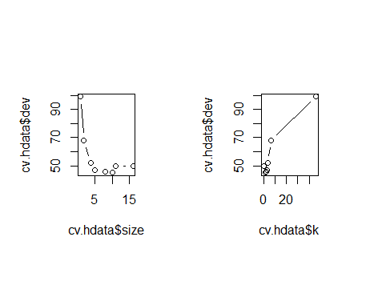
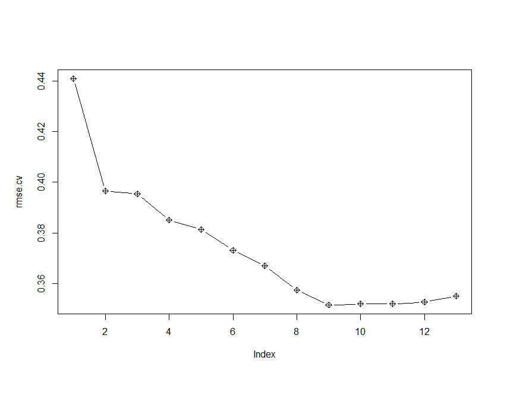

# Data Analysis Project 3

## In this repo, I explore the following Machine Learning/ Data Analysis Methods.

### 1. Best Subset Selection
### 2. Forward Stepwise Selection
### 3. Backward Stepwise Selection
### 4. Boosting
### 5. Bagging
### 6. Classification Trees
### 7. Hierarchichal Clustering
### 8. K Means Clustering
### 9. K Nearest Neighbors
### 10. The Lasso Method
### 11. Linear Discrminant Analysis (LDA)
### 12. Quadratic Discriminant Analysis
### 13. Linear Support Vector Machine
### 14. Nonlinear Support Vector Machines
### 15. Logistic Regression
### 16. Model Selection
### 17. Multiple Linear Regression
### 18. Principal Component Analysis
### 19. Tree Pruning
### 20. Random Forest
### 21. Ridge Regression

## Here are some pictures of the results:

